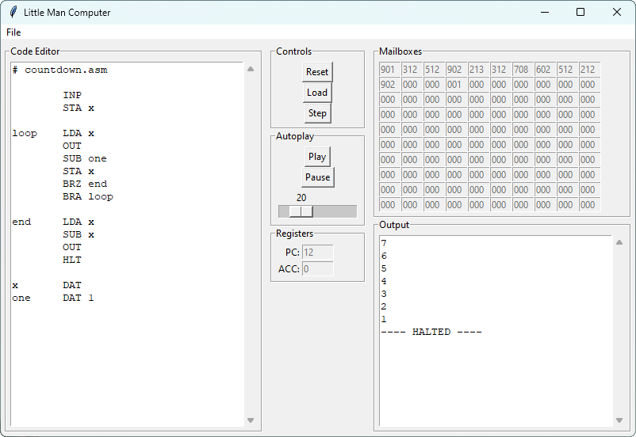

# LMC Simulator

> GUI and CLI programs for interpreting LMC assembly programs. Adapted from code I originally wrote in during my A-Level studies in February 2020.

## Table of Contents

- [About the Project](#about-the-project)
    - [Instruction Set](#instruction-set)
    - [Code Comments](#code-comments)
    - [Example Programs](#example-programs)
- [Prerequisites](#prerequisites])
- [Installation](#installation)
- [Usage](#usage)
    - [Graphical Interface](#graphical-interface)
    - [Command Line Interface](#command-line-interface)
    - [Python Implementation](#python-implementation)
- [License](#license)

## About the project

<br>
<div align="center">
  
</div>
<br>

The Little Man Computer is a simplified model of a CPU using a minimal instruction set. It has a small set specialised registers, and 100 general registers ('mailboxes') for program memory.

- CLI to run LMC programs in your terminal simply via stdin/stdout.
- GUI to run LMC programs with a built-in text editor, register display, and simulation controls.

### Instruction set

| Mnemonic | Name | Description | Opcode |
|-|-|-|-|
| `HLT` | Halt | Stop the code | `000` |
| `ADD` | Add  | Add the contents of the memory address to the Accumulator. | `1xx` |
| `SUB` | Subtract  | Subtract the contents of the memory address from the Accumulator. | `2xx` |
| `STA` | Store | Store the value in the Accumulator in the memory address given. | `3xx` |
| `LDA` | Load  | Load the Accumulator with the contents of the memory address given. | `5xx` |
| `BRA` | Branch always  | Branch/Jump to the address given. | `6xx` |
| `BRZ` | Branch if zero  | Branch/Jump to the address given if the Accumulator is zero. | `7xx` |
| `BRP` | Branch if positive | Branch/Jump to the address given if the Accumulator is zero or positive. | `8xx` |
| `INP` | Input  | Retrieve user input and stores it in the accumulator. | `901` |
| `OUT` | Output  | Output the value stored in the accumulator. | `902` |
| `DAT` | Data location  | Used to associate a label to a free memory address. An optional value can also be used to be stored at the memory address. | |

### Code comments

Source program files can be commented using a `#`. As with most other programming languages: lines of code can have a comment at the end of the line, while lines starting with a comment will be completely ignored by the assembler.

### Example programs

Example programs can be found in the `/programs/` folder.

## Prerequisites

- Python `v3.11`

## Installation

Clone the repository, and then follow the [usage instructions](#usage).

```bash
# Clone the repository
$ git clone https://github.com/TedAlden/little-man-computer

# Navigate to the project directory
$ cd little-man-computer
```

## Usage

As [mentioned](#about-the-project), there are two ways of running the LMC simulator: using a GUI, or using a CLI.

### Graphical Interface

```bash
# Launch the TKinter GUI
$ python src/gui.py
```

### Command Line Interface

```bash
# Run the CLI using the example countdown program
$ python src/cli.py programs/countdown.asm
INPUT> 5
5
4
3
2
1
0
---- HALTED ----
```

### Python Implementation

You can implement the LMC simulator into your own project by importing the `Assembler` and `Simulator` classes from `lmc.py`.

```python
from lmc import Assembler, Simulator

# Assemble program source code into machine code
a = Assembler()
program = a.assemble('''
    INP
    STA x
    INP
    SUB x
    OUT
    x DAT
    HLT
    ''')

# Load machine code into the simulator
sim = Simulator()
sim.load_program(program)

# Run the simulator
while not sim.halted:
    # Perform one Fetch-Decode-Execute cycle
    output = sim.step()
    # Print output if any
    if output is not None:
        print(output)
    # Take input if necessary
    if sim.awaiting_input:
        x = int(input("INPUT> "))
        sim.load_input(x)
    # Display if halted
    if sim.halted:
        print("---- HALTED ----")
```

## License

Distributed under the MIT License. See `LICENSE` for more information.
